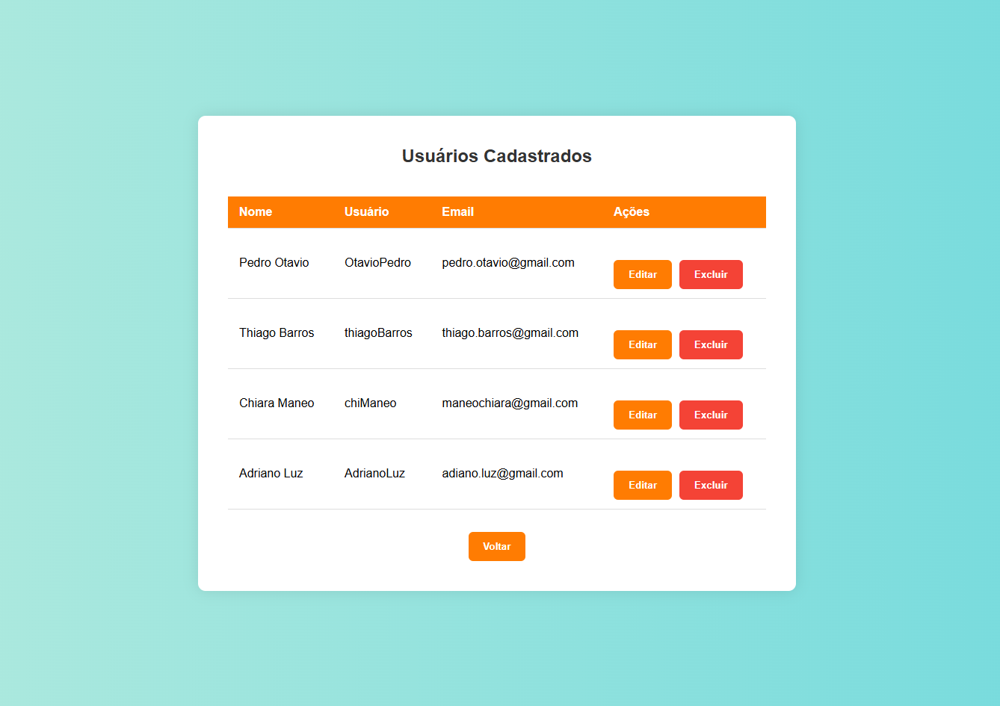

# 🧾 Sistema de Cadastro de Usuários com Firebase

Este é um sistema web de cadastro de usuários com autenticação usando Firebase Authentication e armazenamento de dados no Firebase Firestore. Também há uma tela de listagem de usuários protegida por uma senha de administrador.

---

## 🔧 Funcionalidades

- ✅ Cadastro de novos usuários com email e senha
- ✅ Armazenamento de dados no Firestore (`nome`, `usuário`, `email`, `uid`)
- ✅ Máscara de visualização de senha (ícone de olho)
- ✅ Tela de listagem de usuários em tabela
- ✅ Acesso à listagem protegido por senha simples (`admin`)
- ✅ Edição de dados do usuário (formulário `editar.html`)

---

## 🧰 Tecnologias Utilizadas

- HTML5 e CSS3
- JavaScript ES6 (modular)
- [Firebase Authentication](https://firebase.google.com/products/auth)
- [Firebase Firestore](https://firebase.google.com/products/firestore)
- [Font Awesome](https://fontawesome.com/) (para ícones)

---

## 📁 Estrutura do Projeto

```
FORMULÁRIO/
│
├── css/
│   ├── cadastro.css        # Estilos da tela de cadastro
│   ├── editar.css          # Estilos da tela de edição
│   ├── login.css           # Estilos da tela de login
│   └── usuario.css         # Estilos da lista de usuários
│
├── js/
│   ├── cadastro.js         # Script para cadastro e Firestore
│   ├── editar.js           # Script para editar dados do usuário
│   ├── login.js            # Script (futuro login)
│   └── usuarios.js         # Script de listagem e proteção por senha
│
├── cadastro.html           # Página de cadastro
├── editar.html             # Página de edição dos dados do usuário
├── index.html              # Página inicial / login (pode ser expandida)
├── pagina.html             # Página adicional (sem contexto no momento)
├── usuarios.html           # Listagem de usuários cadastrados
├── README.md               # Este arquivo com as instruções
```

---

## 🔥 Como Configurar o Firebase

1. Crie um projeto no [Firebase Console](https://console.firebase.google.com/).
2. Ative o **Authentication** com **Email/Senha**.
3. Vá em **Firestore Database** > clique em **Criar banco de dados** > selecione modo de teste para início.
4. Copie as credenciais do seu projeto Firebase (em "Configurações do Projeto" > "SDK da Web") e substitua no seu código:

```js
const firebaseConfig = {
  apiKey: "SUA_API_KEY",
  authDomain: "SEU_DOMINIO.firebaseapp.com",
  projectId: "SEU_PROJECT_ID",
  storageBucket: "SEU_BUCKET",
  messagingSenderId: "SEU_SENDER_ID",
  appId: "SEU_APP_ID"
};
```

---

## 🚀 Como Usar

1. Clone ou baixe este repositório:

```bash
git clone https://github.com/seuusuario/formulario-firebase.git
cd formulario-firebase
```

2. Abra o `cadastro.html` em seu navegador e cadastre um novo usuário.

3. Os dados serão armazenados no Firestore.

4. Acesse `usuarios.html` e digite a senha `admin` para ver a lista de usuários.

5. Para editar, clique no botão correspondente e edite via `editar.html`.

---

### Tela de Cadastro


### Lista de Usuários


### Tela de Login


## 🔒 Observações de Segurança

⚠️ A senha `admin` usada para acessar `usuarios.html` **é apenas para fins educacionais**. Em produção:

- Use autenticação real para controlar acessos.
- Proteja as regras do Firestore.
- Nunca exponha senhas no frontend.

---

## 📌 Melhorias Futuras

- Login funcional com controle de sessão
- Logout e restrição de acesso por login
- Responsividade com Bootstrap ou Tailwind
- Remoção de usuários
- Upload de imagem de perfil
- Validações mais robustas no formulário

---

## 👨‍💻 Autor

Desenvolvido por **Chiara Maneo**  
📧 [maneochiara@gmail.com]  

---

## 📝 Licença

Este projeto é livre para fins acadêmicos e experimentais!
